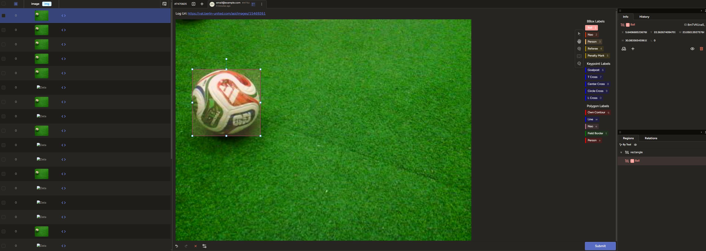

# NaoTH Deep Learning - German Open 2026 Edition
If you want to help out with the ball detection for the Nao's you can do one of the following tasks:

- record logfiles from the field
- label images in label studio
- create large models that annotate images for you in labelstudio
- extract patches from the images with the ScriptableSimulator
- train models on the patches with tensorflow so we can run them on the nao

## Record Logfiles (medium difficulty) 
Before recording logfiles The robots vision must be calibrated (camera parameters, camera matrix, green detection, lines). With this part Thomas and Heinrich can help out and show you how to do that. It's most helpful to record logs when the robot is walking and searching for the ball the same way it would do it during the game. 

!!! Record Logfiles with the Log Stick. Don't record logs via robot control !!!

Upload the logs in the correct folder structure. The log folder on the log stick is named something like this: `3_33_P0000074A10S41M00022_260302-1931`

This folder should be copied to `/vol/repl261-vol4/naoth/logs/2026-03-10-GO26/experiments/<experiment name>`
`<experiment name>` should be named in a way that its clear what the log recorded. I would consider `2026-03-10_ball-test-walking-field-a` a good name. It should be more descriptive than just calling it `log1`

The folder structure should look something like this:
```
2026-03-10-GO26
-> experiments
   -> <experiment name>
      -> 3_33_P0000074A10S41M00022_260302-1931
         -> game.log
         -> images.log
         -> etc....
```

If you do an experiment with multiple robots at the same time you can also put multiple logs in the `<experiment name>` folder.

If this folder structure is done correctly my automation will pick it up and extract all the data from it and puts that in a database. Also labeling tasks for each image will be created automatically. The automation currently runs once per day during the night. I can trigger this anytime I want if you need that.

## Label Images in Labelstudio (easy)
We self host a labelstudio instance ourselves at https://labelstudio.berlin-united.com/ you can get access with credentials I posted in slack (https://naoth.slack.com/archives/C6VT5KF1P/p1773100407409069)

Each log we have from the last year is put into one or more labelstudio projects. Each project contains at a maximum 1000 images. Currently these projects contain images with the new ball:  

https://labelstudio.berlin-united.com/projects/7694/data?tab=7694  
https://labelstudio.berlin-united.com/projects/7695/data?tab=7695  
https://labelstudio.berlin-united.com/projects/7696/data?tab=7696  
https://labelstudio.berlin-united.com/projects/7697/data?tab=7697  
https://labelstudio.berlin-united.com/projects/7698/data?tab=7698  
https://labelstudio.berlin-united.com/projects/7699/data?tab=7699  
https://labelstudio.berlin-united.com/projects/7700/data?tab=7700  
https://labelstudio.berlin-united.com/projects/7701/data?tab=7701  

https://labelstudio.berlin-united.com/projects/7702/data?tab=7702  
https://labelstudio.berlin-united.com/projects/7703/data?tab=7703  
https://labelstudio.berlin-united.com/projects/7704/data?tab=7704  
https://labelstudio.berlin-united.com/projects/7705/data?tab=7705  
https://labelstudio.berlin-united.com/projects/7706/data?tab=7706  
https://labelstudio.berlin-united.com/projects/7707/data?tab=7707  
https://labelstudio.berlin-united.com/projects/7708/data?tab=7708  
https://labelstudio.berlin-united.com/projects/7709/data?tab=7709  

https://labelstudio.berlin-united.com/projects/7710/data?tab=7710  
https://labelstudio.berlin-united.com/projects/7711/data?tab=7711  
https://labelstudio.berlin-united.com/projects/7712/data?tab=7712  
https://labelstudio.berlin-united.com/projects/7713/data?tab=7713  
https://labelstudio.berlin-united.com/projects/7714/data?tab=7714  
https://labelstudio.berlin-united.com/projects/7715/data?tab=7715  
https://labelstudio.berlin-united.com/projects/7716/data?tab=7716  
https://labelstudio.berlin-united.com/projects/7717/data?tab=7717  

https://labelstudio.berlin-united.com/projects/7686/data?tab=7686  
https://labelstudio.berlin-united.com/projects/7687/data?tab=7687  
https://labelstudio.berlin-united.com/projects/7688/data?tab=7688  
https://labelstudio.berlin-united.com/projects/7689/data?tab=7689  
https://labelstudio.berlin-united.com/projects/7690/data?tab=7690  
https://labelstudio.berlin-united.com/projects/7691/data?tab=7691  
https://labelstudio.berlin-united.com/projects/7692/data?tab=7692  
https://labelstudio.berlin-united.com/projects/7693/data?tab=7693  

https://labelstudio.berlin-united.com/projects/7676/data?tab=7676  
https://labelstudio.berlin-united.com/projects/7677/data?tab=7677  
https://labelstudio.berlin-united.com/projects/7678/data?tab=7678  
https://labelstudio.berlin-united.com/projects/7679/data?tab=7679  
https://labelstudio.berlin-united.com/projects/7680/data?tab=7680  
https://labelstudio.berlin-united.com/projects/7681/data?tab=7681  
https://labelstudio.berlin-united.com/projects/7682/data?tab=7682  
https://labelstudio.berlin-united.com/projects/7683/data?tab=7683  
https://labelstudio.berlin-united.com/projects/7684/data?tab=7684  
https://labelstudio.berlin-united.com/projects/7685/data?tab=7685  

Click one of the links and select randomly an image with at least a ball and put a bounding box around all the balls ins the image. It's important to annotate all balls in the image because everything that is not annotated with the ball class is a negative example during training. ignore Images that don't contain a ball or where you are not sure how or if you should annotate it.

One average we need like 30-60 image per link annotated and in total about 1000 images. But it could be that some links dont contain any balls. 

To save an annotation you need to hit submit.



## Create an auto annotation model (medium difficulty) 
The code for training a model that can automat the previous step is in balldetection2026/autolabeling folder. It requires that some images are already annotated by hand.

Setup python with `uv sync`

To download the trainings data you have to run: `python create_trainings_data.py`. Currently it uses the trainings data for validation as well. Feel free to fix this.

Set the environment variables as described in the slack thread 

Run training with `python train.py -c BOTTOM` or `python train.py -c TOP`  your can see the results in MLFLOW: https://mlflow.berlin-united.com/#/experiments/3/runs/be49053c082e418bb800b3f4765ffba7/model-metrics

username and password is in the slack thread.

TODO: add diff between top and bottom camera
TODO: add train/validation split
TODO: add test/eval stage

TODO: document how to apply this model

## Train model on patches
In the folder balldetection2026/patch_based_training are scripts that can use annotations from labelstudio and create patches (32x32). Thise can be given as trainings input. It would be better to use patches from logs. 
Thomas wanted to look into better patches for the new ball. As soon as he is finished with this we can extract those patches from the logs and use them as trainings input.

For improving training on patches we can use the ball detection from Max that served us really well for the last 2 years: The code can be found in ball-detection/detector_cnn_ball_radius_center
